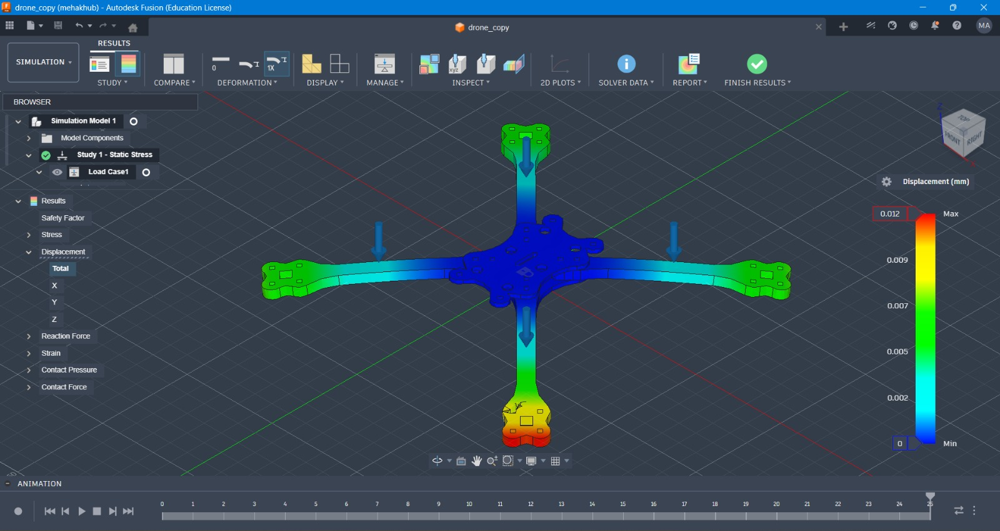

# Drone Frame Structural Analysis

A CAD and Finite Element Analysis (FEA) project focused on evaluating the structural integrity and vibration characteristics of a quadcopter drone frame using Autodesk Fusion 360.

The project combines CAD modeling, static structural analysis, and modal analysis to evaluate stress, deformation, safety factor, and natural frequency behavior under operational loading conditions.

## Project Overview

The objective of this project is to assess whether the designed drone frame can withstand expected operational loads while maintaining adequate structural safety and vibration resistance.

The analysis covers:

- Static structural analysis
- Von Mises stress evaluation
- Displacement and deformation analysis
- Safety factor evaluation
- Modal frequency analysis
- Mesh refinement and simulation setup
- Identification of critical structural regions

## Objectives

- Validate the structural integrity of the drone frame under static loading.
- Identify areas of high stress concentration.
- Evaluate structural deformation under applied loads.
- Determine the safety factor of the frame.
- Study natural frequencies and vibration modes through modal analysis.
- Identify potential design improvement opportunities.

## Software and Tools

- Autodesk Fusion 360
- Fusion 360 Simulation Workspace
- CAD Modeling
- Finite Element Analysis (FEA)
- Static Structural Analysis
- Modal Analysis

## Project Structure

```text
Drone-Frame-Structural-Analysis/
│
├── README.md
├── drone_design.f3d
├── drone_frame.f3d
├── drone_simulation_model.pdf
│
├── Analysis Screenshots/
│   ├── Study-1 static analysis model.png
│   ├── Study-1 constraints.png
│   ├── Study-1 loads.png
│   ├── Study-1 Mesh.png
│   ├── Von mises stress.jpeg
│   ├── Displacement.jpeg
│   ├── Safety Factor.jpeg
│   ├── Modal analyis solve.jpeg
│   └── Study-2 modal analysis.jpeg
│
└── images/
```

## Methodology

### 1. CAD Model Preparation

The original drone frame geometry was prepared for simulation by simplifying non-structural features while retaining the important structural characteristics of the design.

### 2. Material Definition

Material properties were assigned to the structural components to enable stress, deformation, and safety factor calculations during simulation.

### 3. Mesh Generation

The model was discretized using a finite element mesh. Mesh refinement was applied to regions where higher stress gradients were expected, while relatively coarser regions were retained where appropriate to improve computational efficiency.

### 4. Boundary Conditions

Fixed constraints were applied at the central body attachment points.

Operational loads were distributed across the four motor mounting arms to represent the expected loading conditions during flight.

### 5. Simulation

Two primary studies were performed:

- Static Structural Analysis
- Modal Frequency Analysis

The resulting stress, deformation, safety factor, and natural frequency data were evaluated to assess the overall structural performance of the frame.

## Analysis Performed

### Static Structural Analysis

The static analysis evaluates the structural response of the frame under applied operational loads.

Key parameters analyzed:

- Von Mises equivalent stress
- Maximum displacement
- Safety factor
- Stress concentration regions
- Load distribution across the frame

### Modal Analysis

Modal analysis was performed to investigate the dynamic characteristics of the structure.

The study evaluates:

- Natural frequencies
- Mode shapes
- Bending and torsional behavior
- Potential resonance regions

## Analysis Visualizations

### Static Analysis Setup


### Mesh Generation


### Static Analysis Results





### Modal Analysis


## Key Results

| Parameter | Result |
|---|---:|
| Minimum Safety Factor | 15.00 |
| Maximum Displacement | Approximately 0.012 mm |
| Maximum Von Mises Stress | Below material yield limit |
| Stress Concentration | Low to moderate |
| Structural Deflection | Negligible |

The analysis indicates a high calculated structural safety margin under the defined loading conditions.

The maximum deformation was approximately 0.012 mm and occurred around the motor mounting regions. The deformation pattern was relatively symmetric across the four arms.

The primary stress concentration regions were observed around the central frame joints and arm attachment areas.

## Modal Analysis

The modal study was used to identify the natural vibration characteristics of the frame.

| Mode | Description |
|---|---|
| First Mode | First bending mode |
| Second Mode | Torsional mode |
| Third Mode | Coupled structural mode |

The identified natural frequencies were evaluated against typical operating vibration conditions to assess potential resonance risks.

## Design Insights

The analysis provides several engineering observations:

- The frame demonstrates a high safety margin under the defined loading conditions.
- The symmetric geometry provides relatively uniform load distribution across the four arms.
- Structural deformation is small compared with the overall frame dimensions.
- The arm-to-frame joints represent important areas for structural consideration.
- Motor mounting regions experience significant load transfer and should be considered during further design optimization.

## Design Improvement Opportunities

Potential future improvements include:

- Reducing structural mass while maintaining an acceptable safety factor.
- Evaluating alternative materials with improved strength-to-weight ratios.
- Optimizing arm-to-frame joint geometry.
- Adding vibration isolation at motor mounting locations.
- Performing fatigue analysis for cyclic flight loading.
- Performing topology optimization for weight reduction.
- Including aerodynamic and dynamic loading conditions.

## Getting Started

### Requirements

- Autodesk Fusion 360
- Minimum 8 GB RAM recommended for simulation workloads

### View the CAD Model

1. Download `drone_design.f3d` or `drone_frame.f3d`.
2. Open the file using Autodesk Fusion 360.
3. Navigate to the Simulation workspace to inspect the analysis setup.

### Review the Analysis

The complete simulation report is available as:

```text
drone_simulation_model.pdf
```

The `Analysis Screenshots` folder contains the major simulation setup and result visualizations.

## Applications

This project demonstrates practical application of:

- Mechanical CAD
- Finite Element Analysis
- Structural design evaluation
- Engineering simulation
- Design validation
- Vibration analysis
- Safety factor assessment

The methodology can be extended to mechanical components and manufacturing applications where structural performance, material selection, weight optimization, and design validation are important.

## Future Scope

Future development can include:

- Fatigue life analysis
- Thermal analysis
- Impact and crash simulation
- Aerodynamic load integration
- Multi-material comparison
- Topology optimization
- Manufacturing feasibility analysis
- Experimental validation using physical test data

## References

- Autodesk Fusion 360 Simulation Documentation
- Finite Element Analysis fundamentals
- Von Mises stress theory
- Modal analysis and natural frequency concepts
